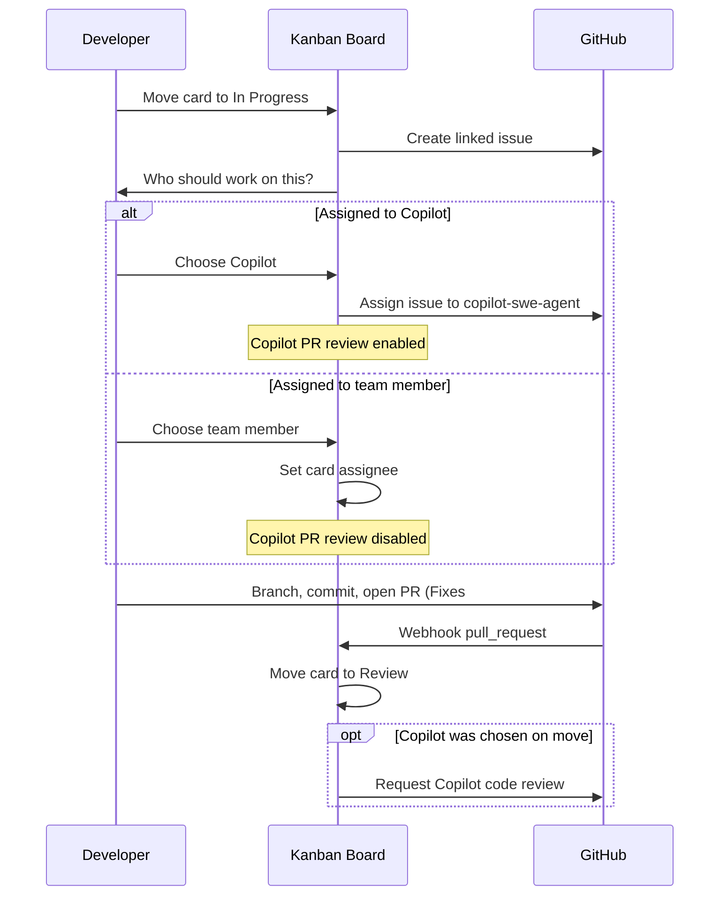

# GitHub + Board Workflow — Team Summary

This document describes the **GitHub-connected sprint workflow** recently added to What the HELL have I done. Share it with anyone setting up boards, connecting repos, or testing the In Progress → PR → Review flow.

---

## What we built

The board can now stay in sync with GitHub across the full dev cycle:

| Step | What happens |
|------|----------------|
| **Move to In Progress** | Creates a linked GitHub issue (when the column is configured) and prompts you to assign work |
| **Assign on move** | Choose **GitHub Copilot** or a **team member** |
| **Open a pull request** | Card moves to **Review** when the PR references the issue |
| **Copilot review** | Requested automatically **only** if the card was assigned to Copilot on move |

Human assignments are **board-only** (card assignee). They do **not** assign the GitHub issue to a person, and they **skip** automatic Copilot PR review.

---

## End-to-end flow

---

## How to use it (day to day)

### One-time board setup

1. **Settings → Integrations** — connect your GitHub account.
2. Open the board → **Settings** → **GitHub Integration** — connect the repository (this registers webhooks for `issues` and `pull_request`).
3. On the **In Progress** column menu (⋯), set **Create GitHub issue**.
4. In board settings, under **Pull request automation**, confirm the target column is **Review** (default on new boards).
5. Add **board members** (email) for anyone who should appear in the team-member picker. Viewers are not assignable.

### Per card

1. Move the card to **In Progress**.
2. In the dialog, pick **GitHub Copilot** or a **team member** (or **Skip for now**).
3. Work in GitHub: branch, commits, open a PR with `Fixes #123` (or `#123` in the title/body).
4. The card should move to **Review**; Copilot review appears on the PR only if you chose Copilot on move.

### Changing your mind later

- Open the card → **Assign to Copilot** re-enables Copilot on the issue and turns automatic PR review back on.

---

## Copilot vs team member

| | GitHub Copilot | Team member |
|---|----------------|-------------|
| Board assignee | Cleared | Set to selected person |
| GitHub issue assignee | `copilot-swe-agent[bot]` | Unchanged (not assigned via the app) |
| Auto Copilot PR review | Yes | No |
| Card still moves to Review on PR | Yes | Yes |

---

## Local development & testing

GitHub must reach your app over **HTTPS** for webhooks to work.

1. Run a queue worker: `php artisan queue:work`
2. Expose the app (e.g. `ngrok http https://your-app.test`)
3. Set `APP_URL` to the public tunnel URL and run `php artisan config:clear`
4. **Disconnect and reconnect** the repo in board settings so the webhook URL updates
5. Move a test card through In Progress → assign → open a PR referencing the issue number

In-app docs: `/docs/github` and `/docs/github-workflow`

---

## Technical reference (for developers)

### New / notable pieces

| Area | Location |
|------|----------|
| Assign work API | `POST /cards/{card}/assign-work` → `GithubController@assignWork` |
| Work assignee dialog | `resources/js/components/boards/work-assignee-dialog.tsx` |
| Board page wiring | `resources/js/pages/boards/show.tsx` |
| Issue creation service | `app/Services/GithubCardIssueService.php` |
| PR issue matching | `app/Services/GithubPullRequestIssueMatcher.php` |
| Webhook processing | `app/Jobs/ProcessGithubWebhook.php` |
| Copilot PR review job | `app/Jobs/RequestGithubCopilotReview.php` |
| Skip review flag | `github_card_links.request_copilot_review` |
| Assignable users | `Board::assignableUsers()` / `assignableMembers` prop |

### Webhook behavior

- Connecting a repo registers a GitHub webhook to `/webhooks/github`.
- On `pull_request` opened / ready for review: find linked issues from PR title, body, or branch name → move card to configured Review column → optionally request `copilot-pull-request-reviewer[bot]`.

### Tests

- `tests/Feature/AssignWorkTest.php`
- `tests/Feature/ProcessGithubWebhookTest.php`
- `tests/Feature/GithubControllerTest.php`

Run: `php artisan test --compact tests/Feature/AssignWorkTest.php tests/Feature/ProcessGithubWebhookTest.php`

---

## Not included (yet)

- Assigning a **human** as the GitHub issue assignee (by design — board assignee only)
- Project invitees who are not **board members** (add them to the board first)
- Assignee prompt on columns other than those with **Create GitHub issue**
- Real-time board updates when webhooks move cards (manual reload still required)

---

## Questions?

- Product behavior: see `/docs/github` in the app.
- Sprint board demo: `docs/boards/sprint-board.md` (local notes, gitignored).
